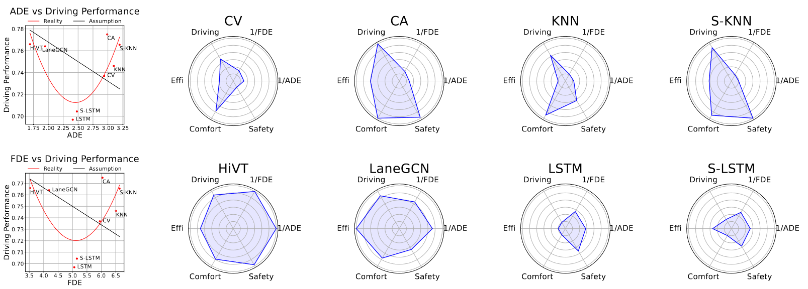

<div align="center">

<h1>What Truly Matters in Trajectory Prediction for Autonomous Driving?</h1>

<div>
Phong Tran<sup>*</sup>&emsp;Haoran Wu<sup>*</sup>&emsp;Cunjun Yu<sup>*</sup>&emsp;Panpan Cai&emsp;Sifa Zheng</a>&emsp;David Hsu</sup>
</div>
<div>
    National University of Singapore, Tsinghua University&emsp;<br>
    Shanghai Jiao Tong University&emsp;<br>
    <sup>*</sup>equal contribution <br>
</div>
<div>
   <strong>NeurIPS 2023</strong>
</div>

<div>
<a target="_blank" href="https://arxiv.org/abs/2306.15136">
  
</a>
<a href="https://hits.seeyoufarm.com"></a>
</div>

<div>

</div>

<h4 align="center">
  <a href="https://whatmatters23.github.io/" target='_blank'>[Project Page]</a> •
  <a href="https://openreview.net/forum?id=nG35q8pNL9" target='_blank'>[Paper]</a>
</h4>

</div>

## Environment
While our code doesn't require any specific packages, each included method has its own environment requirements which are provided in the **References** section.

## Data Structure
The main directory where all code is stored is referred to as *global_path*. The following structure is relative to that directory path:

```
.
├── datasets  # Add argoverse raw csv files here
│   ├── train
│   │   └── data
│   │       └── ... csv files
│   ├── val
│   │   └── data
│   │       └── ... csv files
│   └── test
│       └── data
│           └── ... csv files
├── datasets_summit  # add Alignment raw csv files here
│   ├── summit_10HZ
│   │   ├── train
│   │   │   └── data
│   │   │       └── ... csv files
│   │   ├── val
│   │   │   └── data
│   │   │       └── ... csv files
│   │   └── test
│   │       └── data
│   │           └── ... csv files
├── features  # Preprocessed features are saved here
│   ├── forecasting_features  # Save features for all methods
│   └── ground_truth_data  # Save GT for the dataset
```
#### LINKS
[Alignment dataset](https://drive.google.com/file/d/1YJWZcxmNDUii7ZNB8ga3-c9Qo-BMfMkn/view?usp=drive_link)

[checkpoints](https://drive.google.com/file/d/1EB56vKD7GACqGEQ8AkgBV7qXSsY4X_JU/view?usp=sharing)

## Train & Validate Predictors
```
python train.py configs/method_folder/config_to_use.py
python test.py configs/method_folder/config_to_use.py
```

Change *method_folder* to any folder you want to use, and *config_to_use.py* to any config you hope to try. All configs on Alignment dataset have **summit** in its name.

### Tips

When training KNN, you may find this error: `BLAS : Program is Terminated. Because you tried to allocate too many memory regions`. Using the code below will help fix it:
```
export OPENBLAS_NUM_THREADS=1
export GOTO_NUM_THREADS=1
export OMP_NUM_THREADS=1
```
For training DSP, run the scripts to generate the preprocess data.

## Getting Motion Planning Performance
Go to [Summit Release](https://adacompnus.github.io/summit-docs/references/releases/) and choose the right version for your operating system: 
- 0.9.8e (non-lite version) for Ubuntu 18.04 (the version where the experiment was conducted)

Unzip and put in the home folder ~/summit

## Set up catkin workspace

Run
```bash
cd && mkdir whatmatters
cd whatmatters
git clone https://github.com/AdaCompNUS/WhatMatters
cd WhatMatters
mv * ../
mv .git .gitignore ../
rm -rf WhatMatters
```

## Moving synchronous file to ~/summit folder
```bash
cd && mkdir whatmatters
cd whatmatters
mv gamma_crowd_gammaplanner.py ~/summit/PythonAPI/examples/
```

## Downloading imagery inside summit
```bash
cd && mkdir whatmatters
cd whatmatters
cd ~/src/scripts
python3 launch_docker.py --image cppmayo/melodic_cuda10_1_cudnn7_libtorch_opencv4_ws_noentry
cd summit/Scripts
pip3 install requests
python3 download_imagery.py -d meskel_square
python3 download_imagery.py -d beijing
python3 download_imagery.py -d highway
python3 download_imagery.py -d chandni_chowk
python3 download_imagery.py -d magic
python3 download_imagery.py -d shibuya
python3 download_imagery.py -d shi_men_er_lu

```

## Set up Docker

```bash
docker pull cppmayo/melodic_cuda10_1_cudnn7_libtorch_opencv4_ws_noentry
```

We also need to install docker-nvidia2 as followed guide (https://developer.nvidia.com/blog/gpu-containers-runtime/)

## Build code

```bash
cd ~/src/scripts
python3 launch_docker.py --image cppmayo/melodic_cuda10_1_cudnn7_libtorch_opencv4_ws_noentry
```

Inside docker, run:

```bash
catkin config --merge-devel
catkin clean
catkin build
```
(Ignore the type error of the signal handler) 
After building catkin workspace, exit the docker setup with Ctrl+d

## Get a new docker for executing DESPOT and RVO Planner

```bash
docker pull cppmayo/melodic_cuda10_1_cudnn7_libtorch_opencv4_ws
```

## Running RVO Planner (Recommended mode)

```bash
cd ~/src/scripts
python server_pipeline.py --gpu <gpu_id> --trials <number of runnings>
```

After running, the data will be stored inside `~/driving_data`. Refer to next section for reporting driving performance metrics

## Reporting metrics

```bash
cd ~/src/scripts/experiment_notebook
python Analyze_RVO_DESPOT.py --mode data
python Analyze_RVO_DESPOT.py 
```

Then you will get the plot with x-axis is prediction performancde and y-axis is driving performance

## Citation
```bibtex
@misc{wutran2023truly,
      title={What Truly Matters in Trajectory Prediction for Autonomous Driving?}, 
      author={Haoran Wu and Tran Phong and Cunjun Yu and Panpan Cai and Sifa Zheng and David Hsu},
      year={2023},
      eprint={2306.15136},
      archivePrefix={arXiv},
}
```

## Reference

The code base heavily borrows from:

Argoverse Forecasting: https://github.com/jagjeet-singh/argoverse-forecasting

LaneGCN: https://github.com/uber-research/LaneGCN

HiVT: https://github.com/ZikangZhou/HiVT

DSP: https://github.com/HKUST-Aerial-Robotics/DSP

HOME: https://github.com/Robotmurlock/TNT-VectorNet-and-HOME-Trajectory-Forecasting
